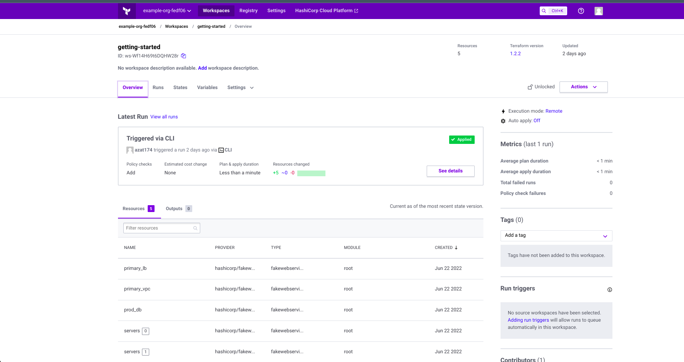

### Домашнее задание к занятию "7.4. Средства командной работы над инфраструктурой."
## задание 1
Настроил terraform-cloud,создал workspace  привезал к  своему  репозиторию.
Запустил через облако.

## Задание 2

